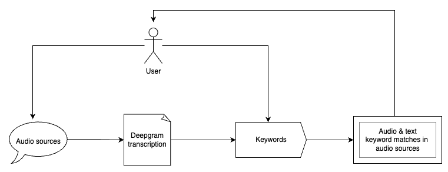

# Speech Search

## About

Search for keywords in a corpus of audio files. Inspect both the text and audio of the sentences containing the keywords.

## Setup

1. Install the requirements:
```
pip3 install -r requirements.txt
```

2. Add your API key in `key.py`

## Run the code

```
python3 dg_demo.py
```

## Example output

Given the keywords "lemurs", "tiktok", "websites", and the podcasts [Why zoos can't buy or sell animals](https://www.npr.org/2023/04/26/1172161875/zoos-barter-trade-elephants-jellyfish), [The economics of the influencer industry](https://www.npr.org/transcripts/1170524077), [30 years ago, one decision altered the course of our connected world](https://www.npr.org/transcripts/1172276538).

<pre>
% python3 dg_demo.py
Finding keywords: ['lemurs', 'tiktok', 'websites']

---> She's got to focus on Goth adjacent Vintage looks, half a million followers on <ins>TikTok</ins>.
---> Kendall Hoye makes short videos on <ins>TikTok</ins> and Instagram where she dresses in different outfits.
---> Like, with half a billion followers on <ins>TikTok</ins> that puts her squarely with the kind of following that the industry counts as an influencer.
---> Are your followers mainly on YouTube or Instagram or <ins>TikTok</ins>.
---> These posts on <ins>TikTok</ins> or Instagram where the influencer showcases a new bag or a skirt.
---> Kendall Hoye charges 4000 dollars for a single <ins>TikTok</ins> post.

---> Still on the list, <ins>lemurs</ins>.
---> Calgary wants black and white <ins>lemurs</ins>.

---> On 04/30/1993, something called The World Wide Web launched into the public domain Interacted appetite searching for a <ins>website</ins>, a window to the world that to get online.
---> The Worldwide web allowed anyone to build a <ins>website</ins> with pictures, video, and sound.
---> The total number of <ins>websites</ins> is doubling every 2 months.
</pre>

## Notable extra features

- The JSON response of Deepgram's transcription for each source is stored in the `transcripts/` directory, to avoid re-transcribing a source.
- Words are stemmed using NLTK, so keywords are not limited to exact matches, but also extend to variations of the same word.
- Keywords in each sentence are pinpointed and underlined in the text for clarity on what matched.

## Architecture diagram


